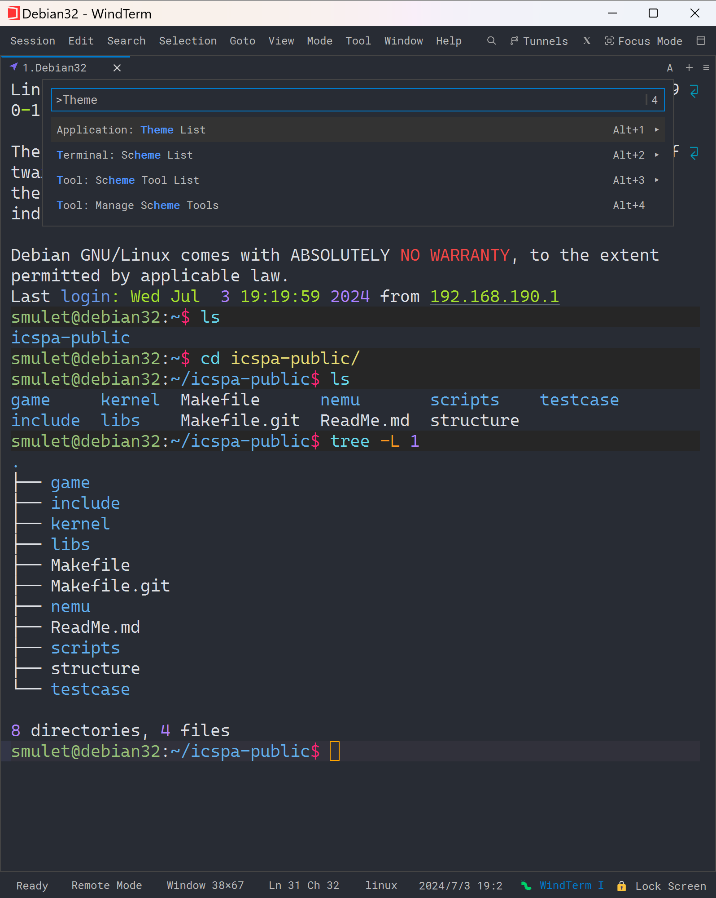

# One Half Dark theme for Windterm
A simple One Half Dark theme for Windterm.

Many places lack replacement.

## Interface 

Font is not included: Cascadia Mono PL SemiLight



## Usage
1. Download the files in the WindTerm/global/themes folder.

2. Enable the theme:
- Select Session > Preferences > Settings > Appaerance > one-half-dark
- *Or* open Command Palette (Alt+;) > Application: Theme List > one-half-dark

## Colour Reference
```
Black: #282C34
BoldBlack: #5A6374
Red: #E06C75
BoldRed: #E06C75
Green: #98C379
BoldGreen: #98C379
Yellow: #E5C07B
BoldYellow: #E5C07B
Blue: #61AFEF
BoldBlue: #61AFEF
Magenta: #C678DD
BoldMagenta: #C678DD
Cyan: #56B6C2
BoldCyan: #56B6C2
White: #DCDFE4
BoldWhite: #DCDFE4
ForegroundColour: #DCDFE4
BackgroundColour: #282C34
CursorColour (Lack replacement): #FFFFFF
```
